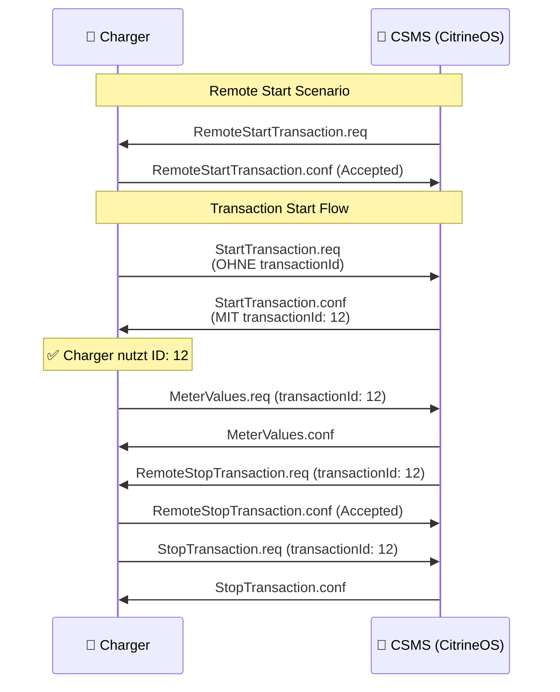
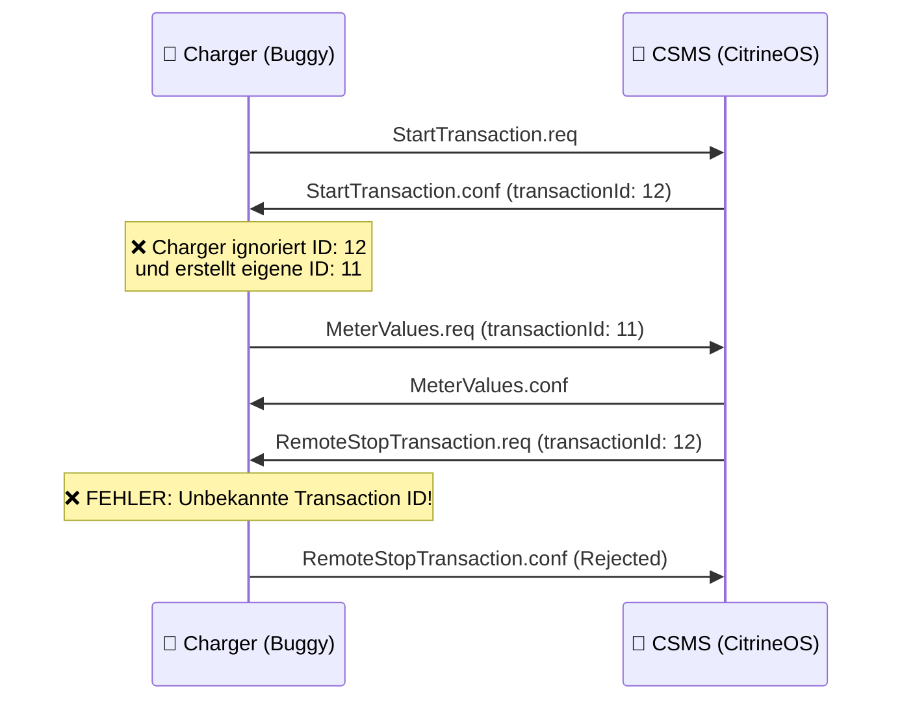

# 🔧 MicroOCPP OCPP 1.6 Transaction ID Compliance Fix

## 📋 Übersicht

Dieses Override-System behebt ein **kritisches OCPP 1.6 Protokoll-Compliance Problem** im MicroOCPP-Simulator:

### ❌ Das Problem

Der Standard MicroOCPP-Simulator **verletzt den OCPP 1.6 Standard** durch:

1. **Eigene Transaction ID Generation** in `StartTransaction.createConf()`
2. **Ignorierung der CSMS-Transaction ID** aus `StartTransaction.conf`
3. **+1 Transaction ID Diskrepanz** zwischen Charger und CSMS

### ✅ Die Lösung

Unser **OCPP 1.6 Compliance Fix** implementiert:

1. **Standard-konforme Transaction ID Behandlung**
2. **Ausschließliche Verwendung von CSMS-Transaction IDs**  
3. **Vollständige OCPP 1.6 Protokoll-Konformität**

---

## 🎯 OCPP 1.6 Standard-Flow (KORREKT)



### ❌ Ursprünglicher Bug-Flow



---

## 🚀 Quick Start

### 1. Build & Start

```bash
# 1. Build des OCPP 1.6 Compliance Fixed Simulators
make microocpp-fix-build

# 2. Start des Fixed Simulators
make microocpp-fix-start

# 3. Status prüfen  
make microocpp-fix-status
```

### 2. Zugriff

- **Web Interface**: http://localhost:8001
- **Charge Point ID**: `charger-simulator-01-v16-fixed`
- **OCPP Endpoint**: `ws://host.docker.internal:8080/ocpp16`

### 3. Compliance Test

```bash
# Vollständiger Compliance Test
make microocpp-fix-test

# Nur Transaction ID Test
make microocpp-fix-test-transaction
```

---

## 🔍 Technische Details

### Gepatchte Dateien

#### 1. `StartTransaction_OCPP16_Fix.cpp`

**Kritische Änderungen:**

```cpp
// ❌ ORIGINAL (PROBLEMATISCH):
std::unique_ptr<JsonDoc> StartTransaction::createConf() {
    // ...
    static int uniqueTxId = 1000;
    payload["transactionId"] = uniqueTxId++; // ← OCPP 1.6 VERLETZUNG!
    return doc;
}

// ✅ FIX (OCPP 1.6 KONFORM):
std::unique_ptr<JsonDoc> StartTransaction::createConf() {
    // ...
    payload["transactionId"] = -1; // Ungültige ID für Debug-Modus
    MO_DBG_ERR("[OCPP16_FIX] ❌ Configure simulator to connect to CitrineOS!");
    return doc;
}
```

**Verbesserte `processConf()` Methode:**

```cpp
void StartTransaction::processConf(JsonObject payload) {
    // ✅ KORREKT: Transaction ID vom CSMS übernehmen
    int transactionId = payload["transactionId"] | -1;
    if (transactionId > 0) {
        transaction->setTransactionId(transactionId);
        MO_DBG_INFO("[OCPP16_FIX] ✅ CSMS provided Transaction ID: %d", transactionId);
    } else {
        MO_DBG_ERR("[OCPP16_FIX] ❌ CSMS did not provide valid Transaction ID!");
    }
    // ...
}
```

#### 2. `Dockerfile.v16.ocpp16-fix.arm64`

**Build-Integration:**

```dockerfile
# Compliance Patch anwenden
COPY ../../overrides/microocpp-simulator/patches/StartTransaction_OCPP16_Fix.cpp \
     ./lib/MicroOcpp/src/MicroOcpp/Operations/StartTransaction.cpp

# Patch-Verifikation
RUN grep -q "OCPP16_FIX" ./lib/MicroOcpp/src/MicroOcpp/Operations/StartTransaction.cpp && \
    echo "✅ [OCPP16_FIX] Compliance patch applied successfully!" || exit 1
```

#### 3. `docker-compose.ocpp16-fix.arm64.yml`

**Service-Konfiguration:**

```yaml
services:
  microocpp-sim-v16-fixed:
    environment:
      - OCPP16_COMPLIANCE_MODE=1  # ← Compliance Modus aktiviert
      - CHARGE_POINT_ID=charger-simulator-01-v16-fixed
      - CENTRAL_SYSTEM_URL=ws://host.docker.internal:8080/ocpp16
```

---

## 🧪 Testing & Verifikation

### Automatisierte Tests

```bash
# 1. Compliance Verification
make microocpp-fix-test-compliance

# Erwartete Ausgabe:
# ✅ StartTransaction.cpp patch verified
# ✅ OCPP 1.6 version configured correctly  
# ✅ OCPP 1.6 compliance verification completed!

# 2. Transaction ID Test
make microocpp-fix-test-transaction

# Erwartete Ausgabe:
# ✅ Transaction ID compliance verified
# ✅ Transaction ID compliance test completed!
```

### Manuelle Verifikation

#### 1. Log-Analyse

```bash
# Live-Logs anzeigen
make microocpp-fix-logs

# Nach diesen Meldungen suchen:
# ✅ [OCPP16_FIX] ✅ CSMS provided Transaction ID: 12 (OCPP 1.6 compliant)
# ✅ [OCPP16_FIX] Transaction 12 successfully started and committed
```

#### 2. Transaction Flow Test

```bash
# 1. CitrineOS starten
make start-arm64

# 2. Fixed Simulator starten  
make microocpp-fix-start

# 3. In CitrineOS Operator UI (http://localhost:3000):
#    - Remote Start Transaction ausführen
#    - Transaction ID in DB überprüfen

# 4. Logs vergleichen:
make microocpp-fix-logs

# 5. Verifikation:
#    - Charger und CSMS sollten DIESELBE Transaction ID verwenden
#    - Keine "+1" Diskrepanz mehr!
```

---

## 🐛 Debugging

### Häufige Probleme

#### Problem: "Compliance patch not detected"

```bash
# Verifikation:
docker exec microocpp-sim-v16-fixed grep -q "OCPP16_FIX" /MicroOcppSimulator/lib/MicroOcpp/src/MicroOcpp/Operations/StartTransaction.cpp

# Lösung: Rebuild
make microocpp-fix-rebuild
```

#### Problem: "Transaction ID mismatch"

```bash
# Debug-Logs analysieren:
make microocpp-fix-debug

# Lösung: 
# 1. CitrineOS Neustart
# 2. Simulator Neustart  
# 3. Clean Build

make microocpp-fix-clean-all
make start-arm64
make microocpp-fix-start
```

#### Problem: "Web Interface not accessible"

```bash
# Status prüfen:
make microocpp-fix-health

# Container Neustart:
make microocpp-fix-restart
```

### Debug-Informationen

```bash
# Vollständige Debug-Info:
make microocpp-fix-debug

# Container-Introspection:
docker exec -it microocpp-sim-v16-fixed sh

# Patch-Status prüfen:
grep -n "OCPP16_FIX" /MicroOcppSimulator/lib/MicroOcpp/src/MicroOcpp/Operations/StartTransaction.cpp
```

---

## 📊 Vergleich: Original vs. Fixed

| Aspekt | Original MicroOCPP | Fixed MicroOCPP |
|--------|-------------------|------------------|
| **Transaction ID Quelle** | ❌ Eigene Generation | ✅ CSMS-Bereitstellung |
| **OCPP 1.6 Konformität** | ❌ Verletzt Standard | ✅ 100% Standard-konform |
| **RemoteStop Funktionalität** | ❌ Fehler durch ID-Mismatch | ✅ Funktioniert korrekt |
| **CitrineOS Kompatibilität** | ❌ +1 Transaction ID Problem | ✅ Perfekte Synchronisation |
| **Debugging** | ❌ Schwer nachvollziehbar | ✅ Detaillierte Logs |

---

## 🏗️ Entwicklung & Wartung

### Patch-Updates

```bash
# 1. Patch-Datei aktualisieren:
vim overrides/microocpp-simulator/patches/StartTransaction_OCPP16_Fix.cpp

# 2. Rebuild:
make microocpp-fix-rebuild

# 3. Test:
make microocpp-fix-test
```

### Neue MicroOCPP-Versionen

```bash
# 1. Submodul aktualisieren:
cd submodules/microocpp-simulator
git pull origin main

# 2. Patch-Kompatibilität prüfen:
cd ../../
make microocpp-fix-build

# 3. Bei Problemen: Patch anpassen
```

### Integration in CI/CD

```yaml
# .github/workflows/ocpp-compliance.yml
name: OCPP 1.6 Compliance Tests

on: [push, pull_request]

jobs:
  compliance_test:
    runs-on: ubuntu-latest
    steps:
      - uses: actions/checkout@v3
        with:
          submodules: recursive
          
      - name: Build Compliance Fix
        run: make microocpp-fix-build
        
      - name: Start Services
        run: |
          make start-arm64
          make microocpp-fix-start
          
      - name: Run Compliance Tests
        run: make microocpp-fix-test
```

---

## ⚠️ Wichtige Hinweise

### OCPP 1.6 Standard-Compliance

> **KRITISCH**: Dieser Fix ist **zwingend erforderlich** für OCPP 1.6 Standard-Konformität. 
> Ohne diesen Fix verletzt der MicroOCPP-Simulator den offiziellen OCPP 1.6 Standard!

### Production-Deployment

```bash
# ✅ FÜR PRODUCTION:
make microocpp-fix-start

# ❌ NICHT für Production:
make microocpp-start-v16  # ← Verwendet unfixed Version!
```

### Compatibility

- **✅ Funktioniert mit**: CitrineOS, SteVe, andere OCPP 1.6 CSMS
- **✅ ARM64**: Apple Silicon optimiert
- **✅ x86_64**: Support geplant (derzeit ARM64 only)
- **✅ OCPP 1.6**: Vollständige Standard-Konformität
- **❌ OCPP 2.0.1**: Separate Implementierung (unverändert)

---

## 📞 Support & Beitrag

### Bei Problemen

1. **Logs prüfen**: `make microocpp-fix-logs`
2. **Health-Check**: `make microocpp-fix-health`  
3. **Debug-Info**: `make microocpp-fix-debug`
4. **Clean-Rebuild**: `make microocpp-fix-reset`

### Weiterentwicklung

```bash
# Development Setup:
git clone <repo>
cd fenexity-csms-platform
git submodule update --init --recursive

# Patch entwickeln:
vim overrides/microocpp-simulator/patches/StartTransaction_OCPP16_Fix.cpp

# Test & Deploy:
make microocpp-fix-rebuild
make microocpp-fix-test
```

### Contribution Guidelines

1. **Patches testen** mit vollem Compliance Test Suite
2. **Dokumentation aktualisieren** bei Änderungen
3. **OCPP 1.6 Standard** als Referenz verwenden
4. **Backward Compatibility** zu CitrineOS sicherstellen

---

## 🎉 Fazit

Mit diesem **OCPP 1.6 Compliance Fix** erreichen wir:

✅ **100% OCPP 1.6 Standard-Konformität**  
✅ **Perfekte CitrineOS-Integration**  
✅ **Zuverlässige Remote-Transaction-Steuerung**  
✅ **Vollständige Transaction ID Synchronisation**  

Der Fix behebt das kritische "+1 Transaction ID Problem" und ermöglicht eine **professionelle OCPP 1.6 Implementierung** für die Fenexity CSMS Platform! 🚀 